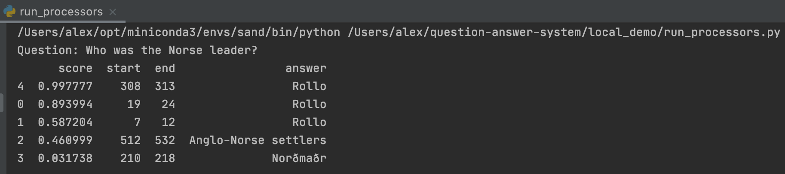

# question-answer-system

## About this project
This project is about creating a question and answer system that runs as AWS StepFunction workflows.

CloudFormation templates are used to define the StepFunction workflows. There is a workflow for embedding a corpus of documents,
and a workflow for asking a question against those documents.

Each workflow contains one or more Lambdas functions. The Lambda functions are executed in a DAG manner.
The code and dependencies of each Lambda are contained in a Docker image.

The ML/data processing code is contained in Processors. Each Processor is a python package.
Each processor has a version and dependencies, and is uploaded to Pypi.

Since each Lambda needs an image, each Lambda has a Dockerfile which installs any Processors that the lambda needs. Pulling the meat of the 
ML/ data processing code into Processors is meant to make this code:
- Easier to test
- Resuable between Lambda functions
- Easy to try out running/debugging in your local environment  

There are also some utils some as data connectors which are treated similarly to Processors 
and also uploaded to Pypi for reuse between Lambdas. 

## Q&A workflow
First, all corpus are embedded using TF-IDF.

Then, when a question is asked, it is also embedded. The question embedding is
compared against all corpus embeddings and the top k most similar documents are taken as 
candidates.

The candidates are then run through a BERT model that is finetuned on the SQUAD Q&A dataset.
This BERT model returns a single answer span and score fore each documents's answer. 

## Todos
- Unit tests!
- Docstrings, logging
- Makefile commands for deploying CFTs and building/pushing Lambda images
- Clean up the interfaces between the handlers (how data is passed)
- Add a diagram of each workflow
- Make sure all processors are uploaded to Pypi
- Add requirements.txt to local_demo
- General cleanup and debugging
- Try deploying to Localstack

## Run Flow locally
`cd local_demo`

create and activate a conda environment

`pip install -r requirements.txt` (this file needs to be updated)

`python run_processors.py`

Here is what the result looks like:

## Credits
Major credit goes to Paton Wongviboonsin who's [blog series](https://medium.com/@patonw/question-answering-with-pytorch-transformers-part-1-8736196bf20e) was very informative on the Q&A logic.
I used a lot of the Q&A logic code from his [repo](https://github.com/patonw/questionable). My contribution is restructuring this logic
into a more modular, scalable, and maintainable/testable system. 

## Localstack
The docker-compose.yaml is used to spin up Localstack,
which fakes the AWS cloud on your local machine and can be used for integration testing and quicker development iteration.